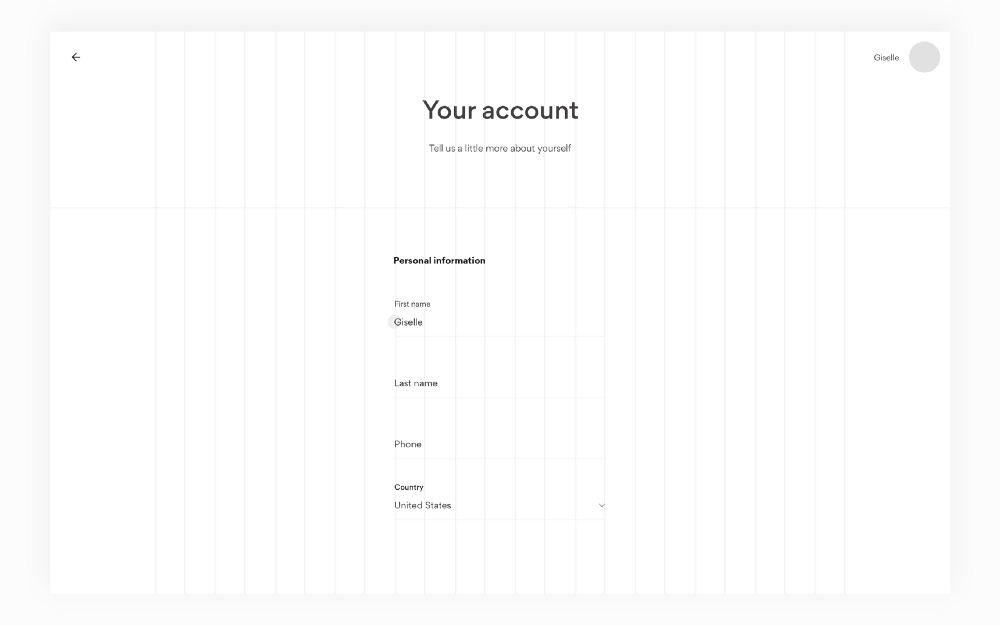
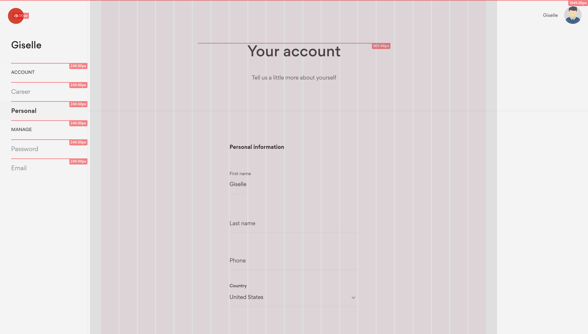

#  Front-end Developer Challenge

The project is <b>desktop</b> and <b>mobile</b> responsive. It's tested on a <b>Full HD Screen</b> (1920 x 1080 pixels) and on  a <b>smartphone</b> with 1080 x 2160 pixels.

The main file is app.scss (SASS) : <b>300 Lines</b> of code.

## Test

##### Devices

<ul>
    <li>SAMSUNG Moniteur 24'' Full HD au design super fin - S24F350</li>
    <li>Huawei P smart</li>
</ul>

##### Browsers

<ul>
    <li>Mozilla Firefox Quantum 64.0.2 (64 bits)</li>
    <li>Google Chrome Version 71.0.3578.98 (Build officiel) (64 bits)</li>
    <li>Microsoft Edge 44.17763.1.0</li>
    <li>Google Chrome for Android Version 71.0.3578.99</li>
    <li>Mozilla Firefox for Android 64.0.1</li>
</ul>

##### Operating systems

<ul>
    <li>Windows 10.0.17763 (64 bits)</li>
    <li>Android 8.0.0</li>
</ul>

## Setup

Install the project dependencies:

`yarn install`

Run the project:

`yarn serve`

## Grid and layout accuracy

The layout is composed of:
<ul>
    <li>Navbar (absolute position): Height=95px ; Width=100%</li>
    <li>Fixed Sidebar: Width=275px ; Height=100%</li>
    <li>Container with a grid system</li>
</ul>

The grid system is based on the flex display property.

##### Real UI grid

    

##### Original .PSD grid

    

